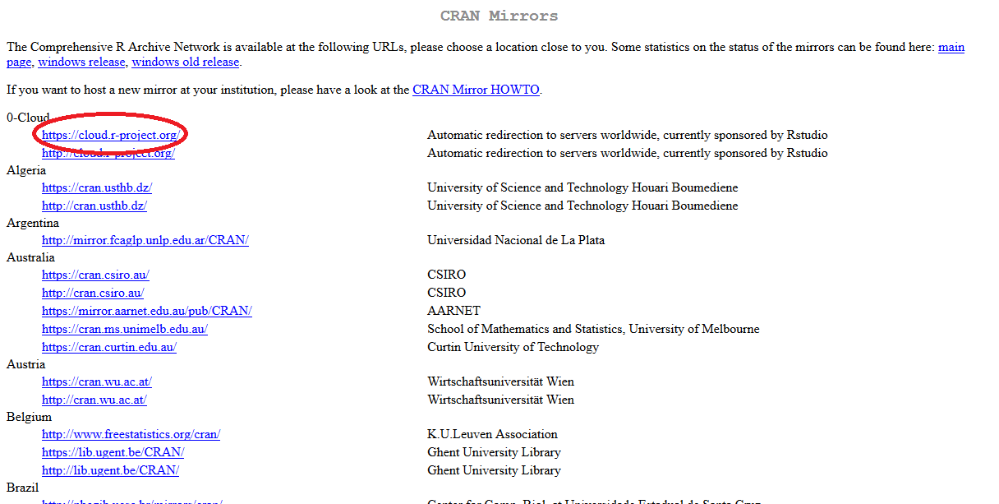
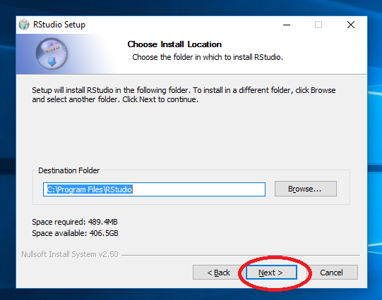
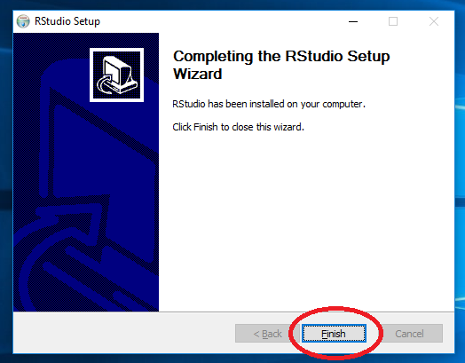

El primer paso antes de escribir la primera línea de código es instalar el software necesario. Para empezar a usar R, necesitamos instalar:

* el intérprete de R (al que también llamamos R); y
* el entorno de desarrollo integrado (IDE) RStudio.

# Instalación de R

1) Dirigirse a <https://www.r-project.org/>.
2) Hacer clic en [CRAN](https://cran.r-project.org/mirrors.html) en la barra lateral.  
    
3) Elegir el mirror [0-Cloud](https://cloud.r-project.org/) (este mirror selecciona automáticamente el mirror más cercano a tu ubicación).  
      
4) Elegir la opción correspondiente a tu sistema operativo: [Linux](https://cloud.r-project.org/bin/linux/), [Mac](https://cloud.r-project.org/bin/macosx/) o [Windows](https://cloud.r-project.org/bin/windows/).  
      

## Instrucciones para la instalación en Windows.

1) Hacer clic en [Download R for Windows](https://cloud.r-project.org/bin/windows/).
2) Hacer clic en [base](https://cloud.r-project.org/).  
    
3) Hacer clic en Download R x.x.x for Windows y descargar el instalador.
4) Abrir el instalador y aceptar los permisos de administrador.  
    
5) Elegir el idioma preferido. Recomiendo instalar R (y, en general, cualquier herramienta de desarrollo) en inglés porque resulta más sencillo encontrar soporte en este idioma (principalmente para resolución de errores de sintaxis).  
     
6) Leer y aceptar los términos y condiciones de la GNU GPL.  
     
7) Seleccionar la ubicación donde se desea instalar R. Recomiendo mantener la opción por defecto.  
     
8) Seleccionar los componentes que se desean instalar. La opción por defecto suele ser la óptima.  
     
9) Si bien customizar la instalación de programas suele evitarnos la instalación silenciosa de adware, en este caso el instalador de R quiere saber si queremos personalizar las opciones de arranque. Seleccionar No (accept defaults).  
     
10) Seleccionar la carpeta donde deseamos encontrar R en el menú inicio. Recomiendo mantener la opción por defecto.  
     
11) Dejar las tareas adicionales con los valores por defecto.  
     
12) Esperar a que la instalación termine.  
     

12) ¡Listo! R ya está instalado.  
     

# Instalación de RStudio

1) Dirigirse a <https://www.rstudio.com/>.
2) Desplegar el menú bajo Products y hacer clic en RStudio.  
     
3) Escrolear hacia abajo y elegir la opción Download RStudio Desktop.  
     

## Instrucciones para la instalación en Windows.
4) Escrolear hacia abajo, elegir RStudio x.x.xxx - Windows Vista 7/8/10 y descargar el instalador.  
     
5) Abrir el instalador y aceptar los permisos de administrador.  
     
6) Seleccionar la ubicación donde se desea instalar RStudio. Recomiendo mantener la opción por defecto.  
     
7) Seleccionar la carpeta donde deseamos encontrar RStudio en el menú inicio. Recomiendo mantener la opción por defecto.  
     
8) Esperar a que la instalación termine.
    
9) ¡Listo! RStudio ya está instalado.  
     

# Ejecutar RStudio

## Instrucciones para Windows

1) Ejecutar desde el menú Inicio.  
     
2) ¡Ya está todo listo para empezar a usar R!  
     

# Nota

Este trabajo es de distribución gratuita, y se encuentra licenciado bajo [Creative Commons Atribución-NoComercial-SinDerivadas 4.0 Internacional (CC BY-NC-ND 4.0)](https://creativecommons.org/licenses/by-nc-nd/4.0/deed.es).
